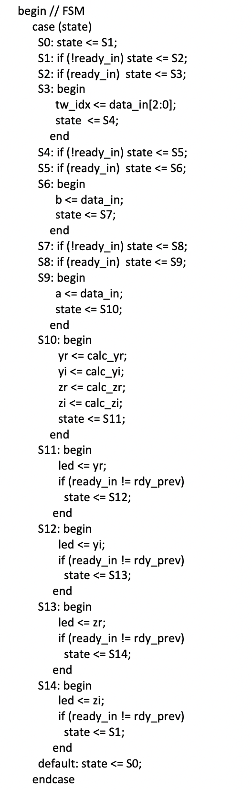
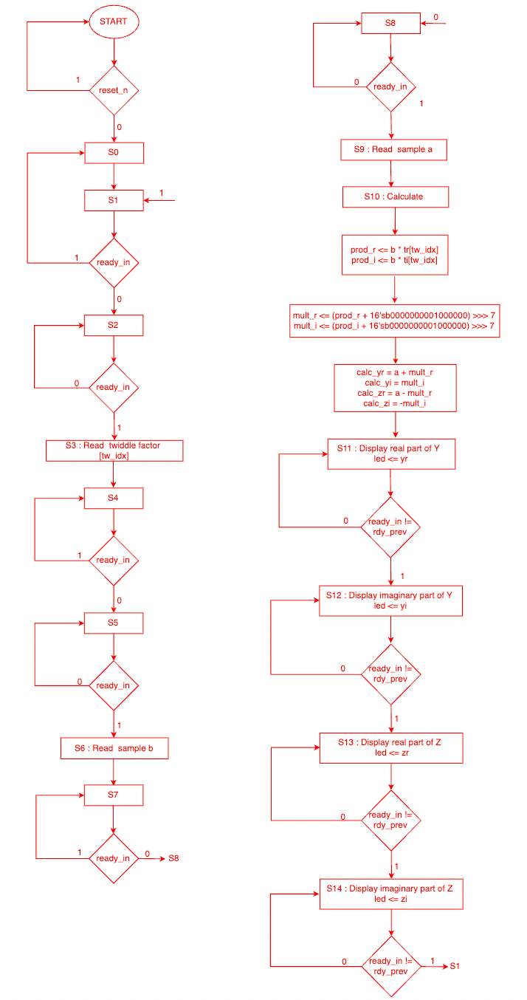
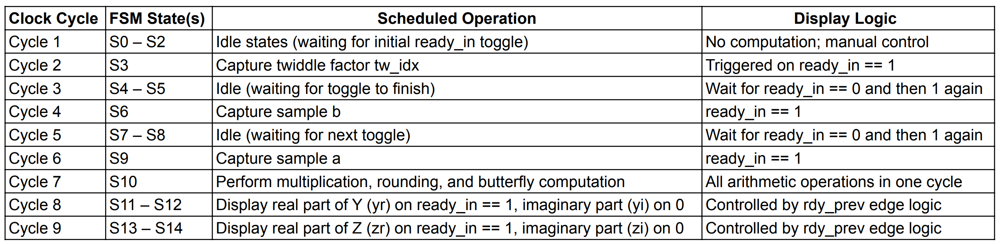
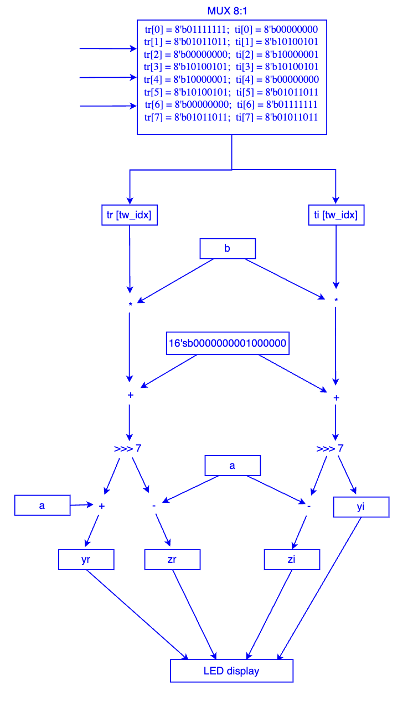
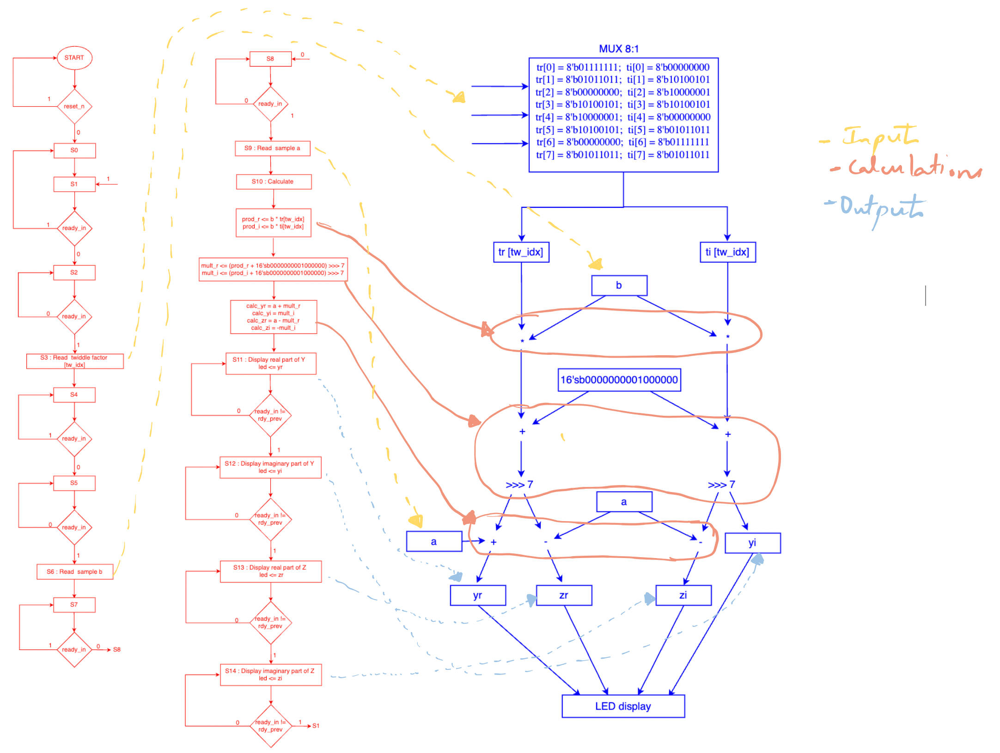
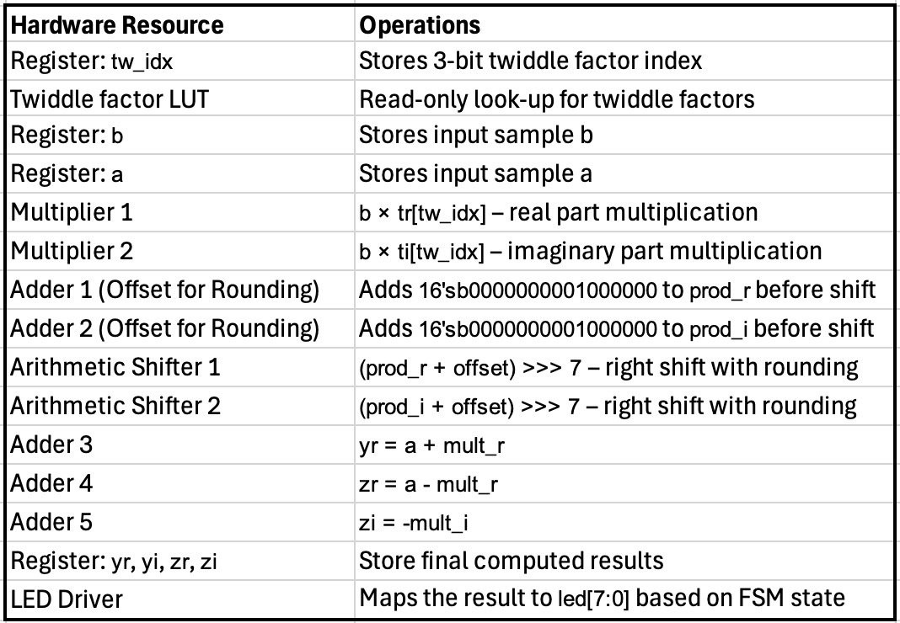
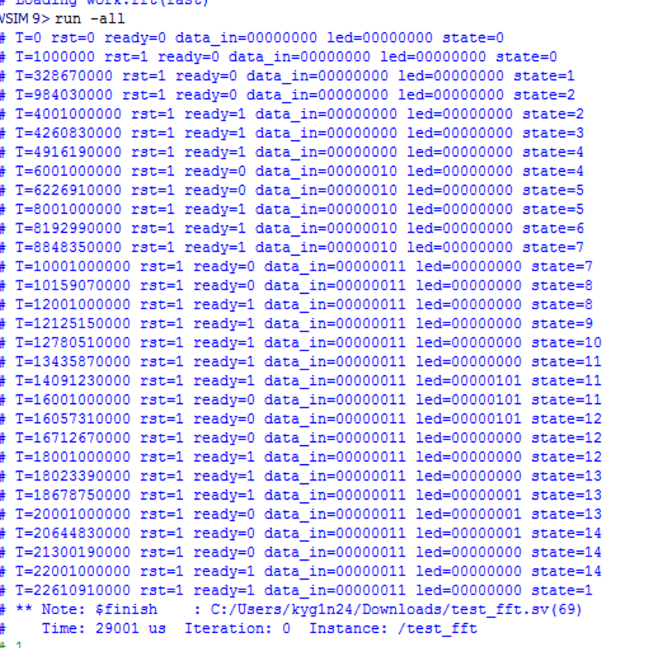
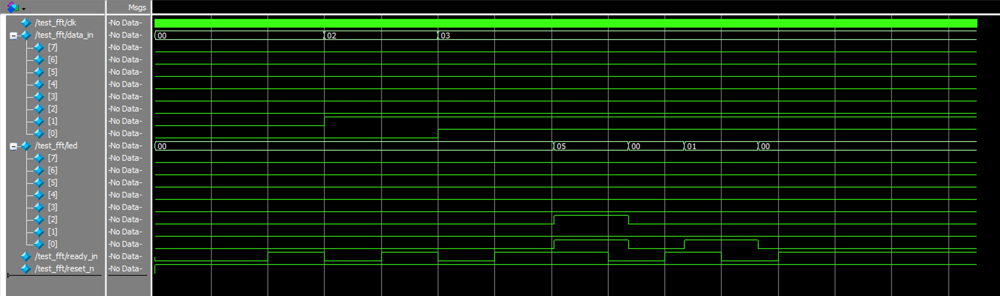

# 8-point-FFT-on-FPGA


This project implements an **8-point Fast Fourier Transform (FFT)** using a **Finite State Machine (FSM)** in SystemVerilog. It was simulated using **ModelSim**, synthesized with **Intel Quartus**, and implemented on a **Cyclone V FPGA** board. Inputs are given via switches and FFT results are displayed via 8-bit LEDs.

---

## 🎥 Demo
🖥️ Local demo video: `FPGA_Output_Demo.mp4` 

---

## 🔧 Key Features

- FSM with 15 states (S0–S14) to manage computation
- Fixed-point arithmetic with rounding: `+64 >>> 7`
- Twiddle factor ROM for `e^(-j2πk/N)`
- Clock divider to make output human-observable
- `rdy_prev` logic to detect edge-triggered input via SW8

---

## 📁 Project Structure

- `src/` – Verilog source (`fft.sv`)
- `testbench/` – ModelSim testbench (`test_fft.sv`)
- `quartus_project/` – Quartus files and reports
- `docs/` – Diagrams: FSM, CDFG, DFG, RTL, etc.
- `FPGA_Output_Demo.mp4` – Output on FPGA
- `README.md` – This file

---

## Diagrams

**FSM State Diagram**  


**Control Flow Graph**  


**Scheduling Diagram**  


**Data Flow Graph**  


**Control + Data Flow (CDFG)**  


**Resource Binding**  


**RTL Diagram**  


**ModelSim Output**  


**Waveform View**  


---

## ▶️ How to Run

### 🧪 Simulation (ModelSim)

```bash
vlog src/fft.sv testbench/test_fft.sv
vsim work.test_fft
```

### ⛓️ Synthesis (Quartus)

- Open `fft.qpf`
- Assign pin mappings:
  - `SW[7:0]` → `data_in`
  - `SW[8]`   → `ready_in`
  - `SW[9]`   → `reset_n`
  - `LED[7:0]` → `led`
- Compile and program the board
- Toggle SW8 to display FFT output in sequence
